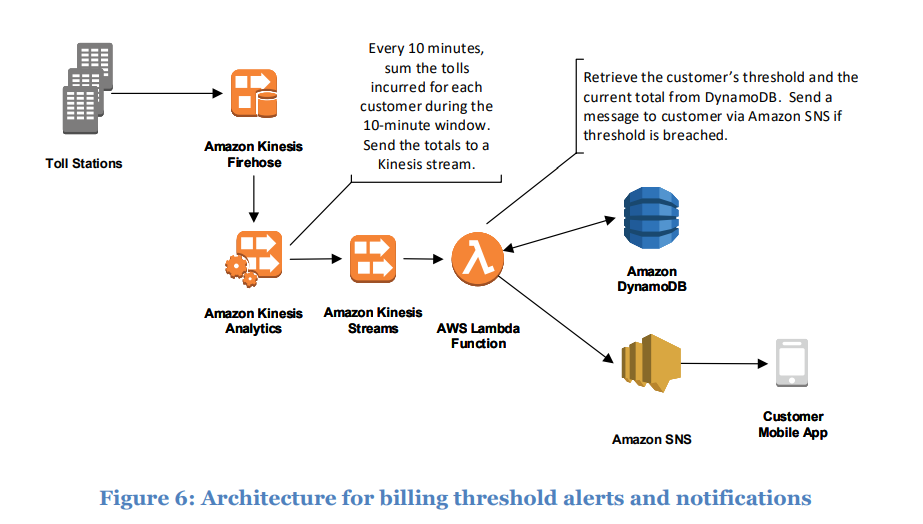

# billing-threshold-alert
Requirement - 2 of the Data solutions on aws kinesis [whitepaper](docs/whitepaper-streaming-data-solutions-on-aws-with-amazon-kinesis.pdf)



***Source: https://d0.awsstatic.com/whitepapers/whitepaper-streaming-data-solutions-on-aws-with-amazon-kinesis.pdf***

## TODO
- Documentation
- Infra-as-code for Producer

## Run tests

```
> docker-compose up -d
```

```
> cd ./tests
> dotnet test Consumer.Tests
```
